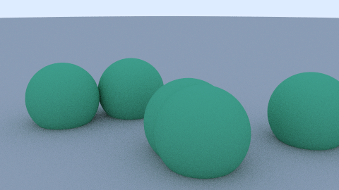
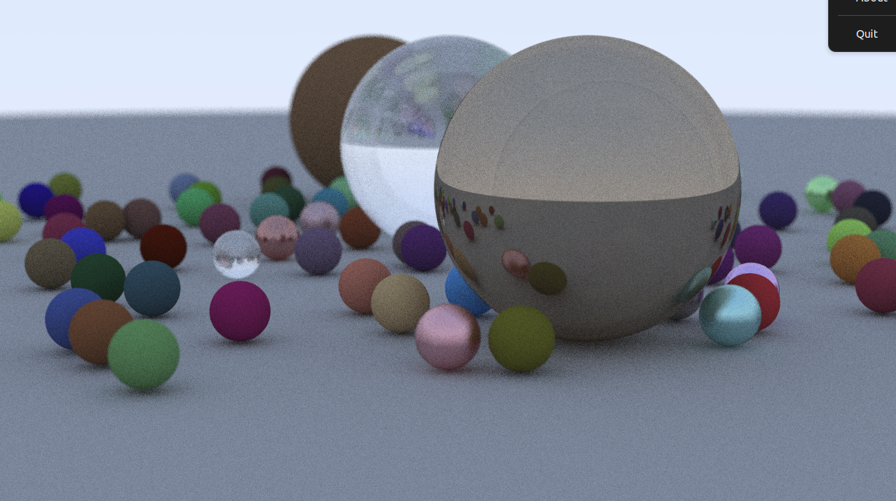

Based on RayTracing in one weekend [book](https://raytracing.github.io/books/RayTracingInOneWeekend.html)

This is a multithreaded version with metaball (lava-lamp) support via ray marching.
It is different from the vanilla version in the following ways:
- Multithreaded rendering with `std::thread`
- Using raw pointers instead of smart ones
- Thread-safe random number generator
- Metaball ray marching with configurable influence radius (`DISABLE_RAY_MARCHING = false` in `src/config.h`)
- Set `DISABLE_RAY_MARCHING = true` to switch back to standard sphere intersection

To build
```
cmake . && make
```

To run (the last number specifies how many threads to use)
```
./inOneWeekend 16
```

Output is written to `image_new.ppm`. For live viewing of the animation:
```
sxiv image_new.ppm
```

## Scenes

There are two rendering modes, controlled by `DISABLE_RAY_MARCHING` in `src/config.h`:

### Standard ray tracing (`DISABLE_RAY_MARCHING = true`)

With ray marching disabled, the blobs render as independent spheres with no merging.

<p align="center">
  
</p>

The original "Ray Tracing in One Weekend" final scene (from an earlier commit with a different scene setup):

<p align="center">
  
</p>

### Metaball ray marching (`DISABLE_RAY_MARCHING = false`, default)

An animated lava-lamp style metaball scene rendered via ray marching. Frames are written to `image_new.ppm` sequentially.

<p align="center">
  
</p>
